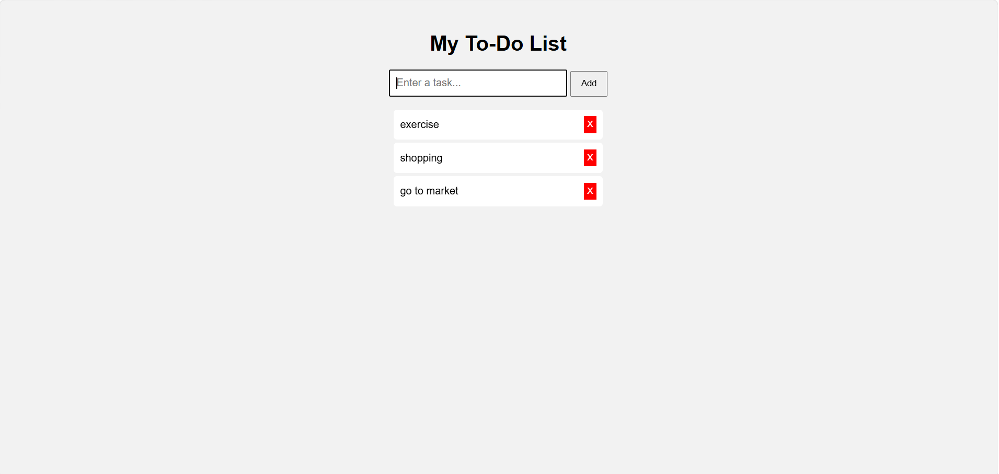

# 📝 ToDoApp

A simple and responsive To-Do List web application that helps users organize and manage daily tasks efficiently.

## 📸 Preview



## 🚀 Features
- Add new tasks
- Mark tasks as completed
- Delete tasks
- Responsive user interface
- Simple and easy to use

## 🛠️ Technologies Used
- HTML5
- CSS3
- JavaScript

## 📂 Project Structure
```
ToDoApp/
│── index.html
│── style.css
│── script.js
└── README.md
```

## 💻 How to Run
1. Clone this repository.
2. Open the project folder.
3. Run `index.html` in your browser.

## 🎯 Future Enhancements
- Dark Mode
- Task Categories
- Due Dates
- Search and Filter Tasks
- Local Storage Support

## 👩‍💻 Author
Bhavana Vandanam
